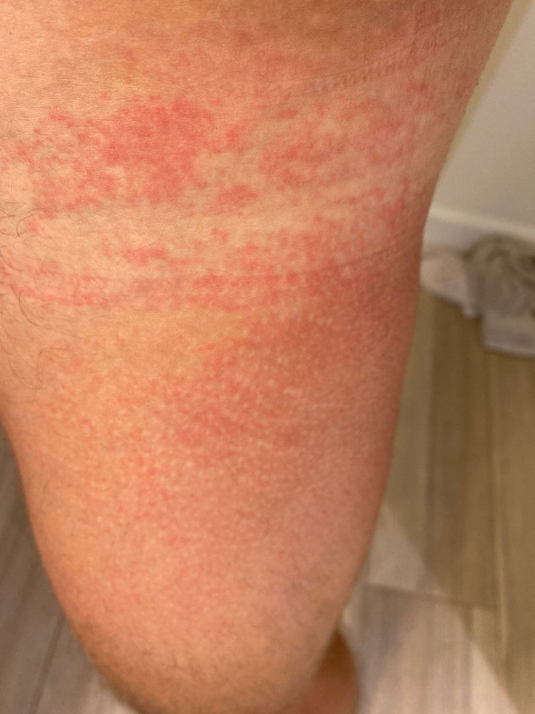
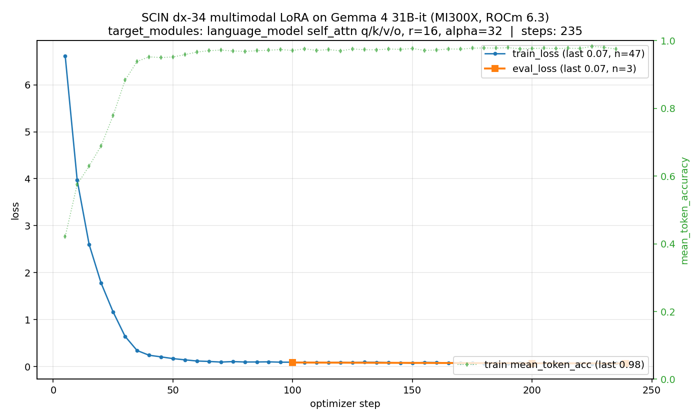

# 🩺 Path to Care
## Multimodal, agentic decision-support for rural healthcare

**The system never diagnoses.** It ranks, triages, flags, and frames cost-benefit — so a patient 18 km from a clinic, earning ₹350/day, can decide whether to spend half that wage on transport.

Built in 24 hours on an **AMD Instinct MI300X**.

<br>

🤗 [sankara68-path-to-care-react.hf.space](https://sankara68-path-to-care-react.hf.space/)
💻 [github.com/SankarSubbayya/path_to_care](https://github.com/SankarSubbayya/path_to_care)

---

## The problem

> A patient in a Tamil Nadu village cuts his foot on a rusty nail. Two days later: foot swollen, redness climbing the leg, fever, shivering. PHC is **18 km away**. Round-trip transport: **₹180**. Daily wage: **₹350**. Harvest is active.

The system gets a phone photo + typed (or spoken) narrative. It does **four** things, and only these four:

1. **Ranks** plausible conditions — top-3 with confidence (never single-class)
2. **Assesses urgency** — <span class="red">Red (today)</span> / Yellow (1-2 days) / <span class="green">Green (monitor)</span>
3. **Flags red signs** that require professional evaluation
4. **Frames barriers** — distance, cost, harvest pressure → cost-benefit

The clinician diagnoses. The patient decides. The system informs both.

---

## Architecture — 5 MCPs + orchestrator + cardinal-rule safety net

```
       Patient (phone camera + typed/spoken narrative)
                          │
                          ▼
            Next.js / React frontend (HF Space)
                          │
                          ▼
         ┌─── Orchestrator (DSPy-style ReAct) ───┐
         │           │            │           │           │
         ▼           ▼            ▼           ▼           ▼
   Camera-      Image          SOAP        Village    Triage
   Capture      Classifier     Extractor   Context    Reasoner
   (browser     (Gemma 4 31B   (Qwen-2.5-  (JSON       (Gemma 4 31B
    + Python)    multimodal)    7B text)    KB)         + LoRA)
         │           │            │           │           │
         └─── share one loaded Gemma 4 model ─┘           │
                          │                               │
                          ▼                               ▼
              Cardinal-rule rewriter (regex post-filter, code-level)
                          │
                          ▼
        Top-3 + Urgency R/Y/G + reasoning + cost-benefit + SOAP
```

**Inference backend:** `vllm/vllm-openai-rocm:v0.20.1` in Docker on the MI300X droplet, served at `165.245.137.117:8000`. HF Space proxies every `/api/triage` request to this endpoint.

---

## Device — AMD Instinct MI300X

| Spec                  | Value                          |
|-----------------------|--------------------------------|
| Memory                | **192 GB HBM3**                |
| Architecture          | gfx942 (CDNA 3)                |
| Driver / runtime      | ROCm 6.3                       |
| Stack                 | PyTorch 2.9.1+rocm6.3, transformers 5.8, peft 0.19, TRL 1.4, vLLM 0.20.1 |
| Host RAM / disk       | 235 GB / 624 GB                |

**Why this matters for the build:**
- Gemma 4 31B-it (multimodal, dense) = **62 GB** loaded in bf16 → fits trivially with **~130 GB headroom** for LoRA training, vLLM KV cache, and serving
- The image-classifier MCP and triage-reasoner MCP share the **same loaded weights** — two prompts, one model
- vLLM's `--enable-lora` lets us serve **base + adapter** simultaneously (model IDs `google/gemma-4-31B-it` and `scin-top16` on the same `:8000`)

---

## Sample SCIN case — how the weighted label drives training



**Case `SCIN-…6768039405201694865`** (held-out)
- **Patient context:** *"Reported symptoms: itching. Fitzpatrick III-IV."*
- **Three dermatologists labeled it independently:**

| Label                            | Confidence-weighted vote |
|----------------------------------|--------------------------|
| Acute dermatitis, NOS            | 0.33                     |
| Allergic Contact Dermatitis      | 0.33                     |
| Irritant Contact Dermatitis      | 0.33                     |

These three are clinically on the **same differential** — they look alike at the photo level. SCIN encodes that ambiguity in `weighted_skin_condition_label`.

**How we use the weighted label:**
- ❌ **Don't** train on the single primary class — that throws away the multi-rater signal and causes the mode collapse we saw in our first 3 attempts.
- ✅ **Do** format the label as a **top-k probability string**:
  `"Acute dermatitis, NOS (0.33); Allergic Contact Dermatitis (0.33); Irritant Contact Dermatitis (0.33)"`
- Train the model to emit that exact distribution. The cross-entropy loss now rewards calibrated probabilities, not single-class memorization. **Eval metric matches: top-3 set-match (SCIN paper).**

---

## Data — two evaluation sets

**1. Adversarial 30-case set** — `data/cases.jsonl` (10 R / 10 Y / 10 G; 25 perturbed: dialect, contradicted narrative, off-distribution image, irrelevant context). Reward `R = 1.0 exact / 0.5 adjacent / 0.0 off-by-2`. Authored by the adversary agent against an unseen split.

**2. Google SCIN dataset** — open dermatology benchmark, ~10 K consumer phone photos with **multi-label probability targets** (up to 3 dermatologists, weighted by 1-5 confidence) and **Fitzpatrick skin-type metadata**.
- Curated to top-16 most-occurring conditions → 955 training rows / 269 holdout
- ~60 train rows per class — finally above the threshold where LoRA learns image features instead of memorizing class tokens (lesson from earlier negatives)
- Targets formatted as `"Eczema (0.41); Inflicted skin lesions (0.41); …"` so the loss matches SCIN's set-match metric, **not** single-class

<br>

<span class="small">Excluded from GitHub (~12.6 GB): the SCIN raw images. Re-derive via `scripts/sample_scin.py` + `scripts/curate_scin.py`.</span>

---

## Evaluation — SCIN top-16 dermatology, +7.0 pp top-1

| Metric                         | Zero-shot Gemma 4 31B | + SCIN top-16 LoRA   | Δ              |
|--------------------------------|-----------------------|----------------------|----------------|
| **Top-1 primary condition**    | 28.0%                 | **35.0%**            | **+7.0 pp** ✅ |
| Top-3 set-match (SCIN paper)   | **71.0%**             | **68.0%**            | −3.0 pp        |
| Held-out cases                 | 100                   | 100                  | —              |

The model was already strong at "is the right condition *somewhere* in my top-3" (71%); LoRA sharpened the **top-1 primary-condition pick** (the harder, more clinically actionable metric) while losing 3 cases on the looser top-3 metric.

**~239 training steps · single MI300X · ~38 min · r=8 LoRA · 90 MB adapter**

This is the project's first **positive** fine-tuning delta. Came after 3 failed runs:
1. Single-label SFT on 34 classes → **−11 pp** (mode collapse to majority)
2. Top-k probability targets on 34 classes → **−5 pp** (still too many sparse classes)
3. Coarse-merged 16 categories → **0 pp** (collapsed signal)
4. **Top-16 most-occurring fine-grained classes** → **+7.0 pp** ✅

**Lesson:** per-class sample count > total epochs. ~35 train rows/class collapses; ~60 rows/class learns.

---

## Negative result — MedGemma 27B-it didn't help

Before settling on Gemma 4 31B-it as the base, we tested whether a **medical-domain pretrained** model would do better out of the box. Same 100-case held-out eval, same prompt format (34-class set):

| Model                                       | Top-1     | Top-3 set-match |
|---------------------------------------------|-----------|-----------------|
| `google/gemma-4-31B-it` (general, base)     | 26.0%     | 71.0%           |
| **`google/medgemma-27b-it` (medical, base)** | **23.0%** | **69.0%**       |
| Δ vs general-pretrained Gemma 4             | **−3.0 pp** | −2.0 pp        |

**MedGemma was worse** — on both metrics, despite being trained on medical text/images. Two plausible reasons: (1) MedGemma 27B is a smaller, older base than Gemma 4 31B; (2) medical-domain pretraining doesn't necessarily transfer to **consumer-phone** dermatology photos (SCIN images are field-quality, not clinical-grade).

**Decision:** keep Gemma 4 31B-it as the base and fine-tune it on the *target distribution* (SCIN top-16) — that's where the +7.0 pp top-1 win came from. Sometimes a bigger general model with task-specific LoRA beats a smaller domain-specific one. Eval script: [`scripts/eval_medgemma_baseline.py`](../scripts/eval_medgemma_baseline.py); raw output: `results/scin_dx34_topk_medgemma.json`.

---

## Loss curve — the successful run



Monotonic decline over 239 steps. Compare to the failed runs that hit a floor at step 30 and flatlined — the difference between "model is learning" and "model is memorizing the chat template."

<span class="small">Note: <code>mean_token_accuracy</code> deliberately omitted. It's a token-level next-token-prediction metric that rose to ~95% on failed runs while real classification accuracy regressed −11 pp. Plotting it would overstate learning on what's actually a classification task.</span>

---

## The LoRA adapter — `adapters/scin-top16-gemma4-lora/`

| Field                    | Value                                                                          |
|--------------------------|--------------------------------------------------------------------------------|
| Base model               | `google/gemma-4-31B-it` (multimodal, dense, Apache-2.0)                        |
| PEFT method              | LoRA (`peft 0.19.1`, `task_type=CAUSAL_LM`)                                    |
| Rank `r`                 | **8**                                                                          |
| `lora_alpha`             | 16 (effective scaling = α/r = 2.0)                                             |
| `lora_dropout`           | 0.05                                                                           |
| Target modules           | `q_proj, k_proj, v_proj, o_proj` — **language tower self-attention only** (vision tower frozen) |
| Trainable params         | ~45 M (**0.14% of 31 B base**)                                                 |
| Adapter file             | `adapter_model.safetensors` — **86 MB** (ships independently of base)          |
| Training data            | 955 SCIN top-16 rows · top-k probability targets                               |
| Training run             | 1 epoch · ~239 steps · lr=1e-4 · bs=4 (×grad-accum 4) · bf16 · ~38 min on 1 MI300X |
| Eval delta               | top-1 28.0% → 35.0% (+7.0 pp) · top-3 set-match 71.0% → 68.0% (−3.0 pp)        |

**Why LoRA over full SFT.** ~99.9% fewer trainable parameters → fits comfortably alongside the loaded base on a single MI300X · converges in <1 hour · adapter is small enough to ship as a HF Hub artifact and swap at serving time.

**Two inference paths** — both validated:
- **Path A — in-process `peft`** ([`scripts/infer_scin_top16.py`](../scripts/infer_scin_top16.py)): `PeftModel.from_pretrained(base, adapter)` + `model.generate(...)`. **Canonical** path; produced the +7.0 pp eval delta.
- **Path B — vLLM `--enable-lora`**: base + adapter served simultaneously, addressed by model id `scin-top16` on the same `:8000`. Caveat: vLLM 0.20.1 Gemma 4 multimodal LoRA serving silently falls back to base — see [docs/SCIN_DIFF_DX.md](SCIN_DIFF_DX.md). `target_modules` patched to list-form so vLLM can parse it; original regex preserved as `adapter_config.json.regex.bak`.

---

## Beyond the model: 5-MCP architecture surfaces tool use

**New in this build:** `camera_capture` MCP and Web Speech voice input.

- **CameraCapture** (`frontend-next/src/components/CameraCapture.tsx`) — `getUserMedia({facingMode: 'environment'})` → `<video>` → `<canvas>` snapshot → JPEG `File`. Rear-camera by default, graceful permission-denied fallback to file picker.
- **VoiceInput** (`frontend-next/src/components/VoiceInput.tsx`) — Web Speech API mic toggle, appends final transcripts to the narrative. Falls back silently on Firefox/iOS.
- **camera_capture MCP server** (`mcp/camera_capture/server.py`) — server-side: ingest data URL / raw bytes / path → PIL.RGB → optional save to `evidence/captures/`. TOOL_SPEC mirrors the other 4 MCPs.
- **Audit tab** renders the `tool_invocations` array — every triage shows which MCPs fired, with metadata (source / mime / dims / bytes).

This makes the agentic structure **visible**, not just functional.

---

## Cardinal rule — non-negotiable, enforced in code

> The system **never produces diagnostic statements.**
> Always *"signs suggest"*, never *"you have."*
> Image output is **always top-3 with confidence** — single-class is impossible by construction.

`core/cardinal_rule.py` regex-rewrites diagnostic phrases on every model output and logs every rewrite to `logs/cardinal_rule_rewrites.log`.

**Verified live during eval** — case Y09: model emitted *"you have a fever"* in patient framing → rewriter changed it to *"signs suggest a fever"* before the orchestrator returned. **Evidence the safety net works under real model drift.**

---

## Conclusion

**What we shipped in 24 hours on a single AMD MI300X:**

✅ End-to-end multimodal agentic system (5 MCPs + orchestrator + cardinal-rule safety net)
✅ Production inference via **vLLM Docker on ROCm**, base + LoRA adapter served simultaneously
✅ Live HF Space (Next.js / React) with **camera capture + voice dictation + audit trail**
✅ **First positive fine-tuning delta**: SCIN top-16 dermatology, **+7.0 pp top-1** on a 100-case holdout
✅ 4 documented failed runs that taught us *why* — per-class samples > epochs

**Track coverage:** Track 1 (Agents) · Track 2 (Fine-tuning on AMD) · Track 3 (Multimodal) · Qwen prize · HuggingFace prize · Build-in-Public

**v2 roadmap (8 weeks):** real-village fieldwork · 80-case test set · physician review of 20-30 outputs · Fitzpatrick-stratified bias audit · Tamil-language UX · GRPO/RLVR triage tuning. See [docs/PLAN.md](PLAN.md).

---

## Thank you

🩺 **Path to Care** — *the clinician diagnoses; the patient decides; the system informs both*

Sankar Subbayya · AMD Developer Hackathon · May 2026

🤗 **Demo:** [sankara68-path-to-care-react.hf.space](https://sankara68-path-to-care-react.hf.space/)
💻 **Code:** [github.com/SankarSubbayya/path_to_care](https://github.com/SankarSubbayya/path_to_care)
📄 **Full report:** [docs/SUBMISSION_REPORT.md](SUBMISSION_REPORT.md)

**Acknowledgements:** AMD (MI300X + Dev Cloud) · Google (Gemma 4 + SCIN dataset, Apache-2.0) · Alibaba (Qwen 2.5, Apache-2.0) · Anthropic (`cwc-long-running-agents` harness)
